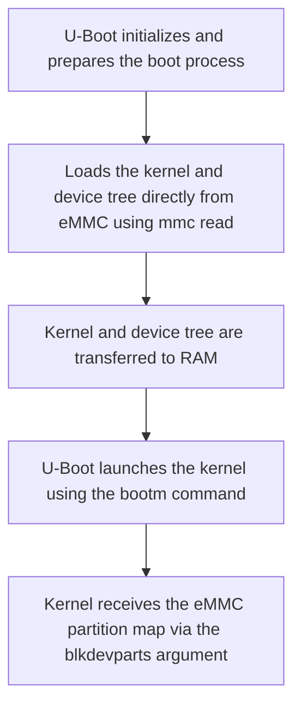

# Linux on eMMC for Amlogic S905
When you get stubborn about the Amlogic S905...
A few years ago, I purchased an MXQ Pro 4K (extended name: Amlogic S905 with DTB Meson GXBB p201), an Android TV box designed to upgrade an old television by introducing the capabilities of Google's operating system, allowing access to apps and more. Later on, I discovered communities that had made these devices highly efficient by installing minimal Linux distributions on them. My first thanks go to those communities: the people behind LibreELEC (especially kszaq), coreELEC, Kodi, and everyone developing and sharing solutions. Using Kodi directly, without going through Android, made everything smoother, and the countless plugins enabled virtually unlimited expansion of the TV box. For example, tvheadend, when combined with a USB stick (similar to those used for SKY), transformed it into a DVB-T decoder as well.

Over the years, the advent of Android TVs has made this small but great device somewhat obsolete. As I always do when a device no longer meets the minimum requirements for its original purpose, I start looking for an alternative use… Since it's essentially an SBC (Single Board Computer) with decent technical specifications that, for the same price, surpass those of more well-known boards (like RPi, BPi, Odroid, Asus, etc.), its most logical use was as a Linux server. I immediately started looking into the most commonly used distributions for these devices: Armbian, DietPi, Alpine, and so on. That’s how I came across the work of balbes150, hexdump, SteeMan, and many others, to whom I am deeply grateful. Their efforts help recycle and give new life to devices otherwise destined for the trash, which has significant positive impacts both for the environment and for our wallets.

Installing Armbian for the Amlogic S905 on an SD card was simple and convenient, allowing access to a high-quality, highly efficient Debian distribution. I was used to installing the OS on eMMC since my days with LibreELEC, so I was ready to follow the instructions to proceed. This is where the problems began. At first, I couldn’t understand why an internal installation presented so many issues. The more I read, the clearer the bug became. Each time I tried formatting the internal memory, the TV box stopped responding entirely, and the only solution I knew was to flash the original Android image to reset the project and start over.

Everything changed when I found an article on the Armbian forum by pista. He had also faced the same issue, but unlike anyone else at the time, he approached it from a fresh perspective, finding an elegant solution that worked wonderfully. From his article, I learned that Amlogic’s engineers had made an error: the bootloader was placed where it shouldn’t have been, so any attempt to redesign the eMMC partitions resulted in a bricked device.

There is a command (`blkdevparts`) that can be passed as an argument from U-Boot directly to the kernel by setting the "bootargs" environment variable. This allows the kernel to receive an eMMC partition map, which we can’t create traditionally due to the previously mentioned limitations. Pista's original idea was to leverage this command to instruct the kernel on where to find the root partition. His second insight, however, was to use the "mmc read" command instead of the classic "fatload", since the kernel needs to be loaded by U-Boot, which knows nothing about how the internal memory is partitioned. The boot sequence, therefore, involves loading the kernel and device tree, passing the partition map to the former, and then letting it complete the boot process.


# naming partitions
Reading 7Ji's blog, particularly [this](https://7ji.github.io/embedded/2023/02/20/gxbb-emmc.html) article, I learned how to name partitions, simplifying the dd command by specifying the partition name. For example, to write the kernel, it’s enough to define the of=/dev/block/kernel parameter within the command, immediately identifying the location to write to on the eMMC.
```
tee /etc/udev/rules.d/99-emmc-links.rules > /dev/null <<EOF
SUBSYSTEM=="block", KERNEL=="mmcblk1p*", ENV{DEVTYPE}=="partition", SYMLINK+="block/$env{PARTNAME}"
EOF
```
# ram and emmc addresses
setenv os_addr            0x02000000  
setenv emmc_os_offset     0x2100  
setenv emmc_os_size       0xFF00  
setenv dtb_addr           0x04000000  
setenv emmc_dtb_offset    0x2060  
setenv emmc_dtb_size      0xa0  

# args passed to kernel
setenv bootargs           'blkdevparts=mmcblk1:4M(bootloader),48K@4M(emmc),80K@4144K(dtb),32640K@4224K(kernel),856M@36M(env),-(root) zswap.enabled=0 root=/dev/mmcblk1p6 rw rootfstype=ext4 rootwait console=tty0 no_console_suspend consoleblank=0 coherent_pool=2M net.ifnames=0 fsck.repair=yes fsck.mode=skip init_on_alloc=1 init_on_free=1 randomize_kstack_offset=on kfence.sample_interval=100 debugfs=off kfence.deferrable=1 watchdog.stop_on_reboot=0'  

# loading device tree
mmc read ${dtb_addr} ${emmc_dtb_offset} ${emmc_dtb_size}  
# read Linux kernel
mmc read ${os_addr} ${emmc_os_offset} ${emmc_os_size}  

In my search for distributions for TV boxes, I came across a fascinating project by developer devmfc. He has created an extremely lightweight distribution available in two versions, one based on Debian and the other on Ubuntu. As I mentioned earlier, I value efficiency, and this distribution represents the ideal setup for me. Moreover, the developer hacked Amlogic’s customized U-Boot (stock version) by identifying the header that makes it recognize the expected kernel—rejecting any other, including ours. This elegant solution eliminates the need for chainloading with a second U-Boot (mainline), as is typically required with other distributions, where a secondary bootloader is needed to launch the kernel.

After gathering all this information, the final step is to develop a solution that allows us to customize the partition table to fit our needs. Specifically, my original partition map, before customization, was as follows:

|    Address    |  size  | gap |     Block     |
| ------------- | ------ | --- | ------------- |
|       0       |    4M  | 32M |   bootloader  |
|      36M      |   64M  |  8M |    reserved   |
|     108M      |  768M  |  8M |     cache     |
|     884M      |    8M  |  8M |      env      |
|     900M      |   32M  |  8M |     logo      |
|     940M      |   32M  |  8M |    recovery   |
|     980M      |    8M  |  8M |      rsv      |
|     996M      |    8M  |  8M |      tee      |
|    1012M      |   32M  |  8M |     crypt     |
|    1052M      |   32M  |  8M |    bootmisc   |
|    1092M      |  512M  |  8M |   instaboot   |
|    1612M      |   32M  |  8M |     boot      |
|    1652M      | 1408M  |  8M |    system     |
|    3068M      | 4325M  |     |     data      |

it could become:

|    Address    |  size  |     Block     |
| ------------- | ------ | ------------- |
|       0       |     4M |   bootloader  |
|       4M      |    48K |      emmc     |
|    4144K      |    80K |      dtb      |
|    4224K      | 32640K |     kernel    |
|      36M      |   856M |      env      |
|     892M      |    -   |      root     |
